# Notes Python

# POO en Python

## POO : Les classes

### Introduction

Une classe contient un état et un comportement :
- l'**état** fait référence à des données ou des variables
- le **comportement** désigne une série de chose que la classe peut faire.

En POO il existe trois types d'attributs :
- les attributs d'**instance** : propres aux instances crées
- les attributs de **classe** (propre à la classe et partagés entre les instances)
- les attributes **statiques** : presque indépendants de la classe

### Syntaxe en python

#### Création d'une classe

``` python
class Rectangle
  def __init__(self, length, width, color='red'):
    self.length = length
    self.width = width
    self.color = color

  def calculateArea(self):
    return self.width * self.height

```

Les méthodes d'instance incluent toujours "self" en 1er paramètre.

La méthode `__init__` est une méthode magique en python. Elle est nommé constructeur.
Lors de la création, l'instanciation, de la classe il faudra founir les attributs attendu par le constructeur. 

Il faudra fournir `length` et `width` en respectant l'ordre tandis que ``color`` est facultatif car une valeur par début à été défini à ``red``

- Les **attributs d'instance** sont donc des variables définies à l'aide de ``self``. Elles sont relatives à l'instance, et ne peuvent être accédées dans instanciations. Les méthodes de classe sont des méthodes classiques sui possèdent ``self`` en **premier paramètre**.
- Les **attributs de classe** sont donc des variables définies directement **dans le corps de la classe**. Elles peuvent être accédées par la classe sans passer par l'instanciations. Les attributs de classe peuvent **se référencer entre eux** mais ne peuvent pas accéder aux attributs d'instance. Les méthodes de classe sont précédées par`` @classmethod``, et leur premier paramètre sera ``cls`` à la place de ``self``. Les attributs de classe sont souvent utilisés pour créer des données ou des actions gloables à la classe, qui **ne dépendent pas** d'une instance. Les instances peuvent cependant y accéder. Modifier un attribut de classe dans une instance le modifiera **dans toutes les autres**.
- Les attributs statiques sont des attributs qui n'ont pratiquement aucun lien avec la classe. Seules les méthodes peuvent être statique. Pour les créer il suffit de les faire précéder par ``@staticmethod``.

``` python
class Bird:
    """Un oiseau. 🐦"""

    # ici on utilise deux attributs de classe.
    names = ("mouette", "pigeon", "moineau", "hirrondelle")
    positions = {}

    def __init__(self, name):
        """Les attributs définis ici sont des attributs d'instance."""
        self.position = 1, 2
        self.name = name
        
        # On accède à l'attribut de classe "positions" avec self (c'est possible).
        self.positions[self.position] = self.name

    @classmethod
    def find_bird(cls, position):
        """Retrouve un oiseau selon la position donnée."""
        if position in cls.positions:
            return f"On a trouvé un {cls.positions[position]} !"

        return "On a rien trouvé..."
    
    @staticmethod
    def get_definition():
        """Donne la définition d'un oiseau."""
        return (
        "Animal (vertébré à sang chaud) au corps recouvert de plumes, "
        "dont les membres antérieurs sont des ailes et qui a un bec."
        )


# On peut accéder aux variables de classe sans instanciation.
Bird.names
Bird.positions
print(Bird.find_bird((2, 5)))

# On instancie un oiseau
bird = Bird("mouette")

# On le retrouve avec la méthode find_bird.
print(Bird.find_bird((1, 2)))
# méthode statique
print(Bird.get_definition())
```

Il est recommander de privilégier les attributs d'instance qui permettenbt d'utiliser la POO à son plein potentiel. Les attributs de classe peuvent être très utiles, mais sont plus rares. Les attributs statiques sont à l'opposé du paradigme orienté objet, il faut éviter de les utiliser, quitte à utiliser un attribut de classe à la place.

#### Instanciation d'une classe

``` python
rect1 = Rectangle(5, 3)
rect2 = Rectangle(4, 2, "blue")
rect3 = Rectangle(3, 1, color="pink")
rect4 = Rectangle(length=2, width=3, color="white")
```

#### Accès et Modification d'un objet

``` python
print(rectangle.length)
rectangle.color = "yellow"
area = rectangle.calculate_area()
print(area)
```

### L'héritage en python

#### L'héritage

L'héritage permet de créer une **classe enfant** à partir d'une **classe parent**, qui contient les attributs du **parent** ainsi que d'autres attributs spécifiques à l'**enfant**. Cela permet de réutiliser le code sans avoir à le dupliquer.

Pour définir une classe **enfant**, il suffit de mettre le nom de la classe enfant **entre parenthèse** après le nom de classe : ``class Enfant(Parent)``.

#### La surcharge

La **surcharge** désigne le concept selon lequel une classe enfant crée un **nouvelle implémentation** d'une **méthode héritée** : lorsqu'un méthode dans une classe enfant est créée avec le **même nom** et la **même signature** qu'une méthode dans la classe parent, la méthode enfant l'**emporte**.

``` python
from abc import ABC   # permet de définir des classes de base

class Shape(ABC):
    def area(self):
        return 0


class Square(Shape):
    def __init__(self, length):
        self.length = length

    def area(self):
        return length * length
```
Dans ce cas **ABC**, signifie **Abstract Base Class**. C'est le mécanisme python pour implémenter une **classe abstraite**. C'est une classe qui ne peut pas être **instanciée**. Une classe abstraite peut aussi insister pour qu'une méthode soit implémentée par ses enfants, pour cela on utilise le décorateur ``@abstractmethod``.

#### L'héritage multiple

L'héritage multiple est aussi possible en mettant entre parenthèses les différentes classes parents séparées par des virgules : ``class Enfant(ParentUn,ParentDeux, ...)``. L'héritage multiple est à utiliser avec précaution. Il existe généralement des design plus simples et plus faciles.

Si deux classes parentes implémentent la même méthode, python choisira celle qui est présente dans la classe la plus à gauche.


#### super()

L'**héritage** permet de récupérer les méthodes de la classe Parent. La **surcharge** permet de modifier entièrement les méthodes héritées. **super()** va permettre de récupérer le code des classes Parents depuis les classes Enfants.

``` python
class Drink:
    """Une boisson."""

    def __init__(self, price):
        """Initialise un prix."""
        self.price = price

    def drink(self):
        """Boire la boisson."""
        print("Je ne sais pas ce que c'est, mais je le bois.")


class Coffee(Drink):
    """Café."""
    
    prices = {"simple": 1, "serré": 1, "allongé": 1.5}

    def __init__(self, type):
        """Initialise le type du café."""
        self.type = type
        super().__init__(price=self.prices.get(type, 1))


    def drink(self):
      """Boire le café."""
      print("Un bon café pour me réveiller !")
```

Dans cette exemple ``Coffee`` est une sous-classe de ``Drink``, elle possède ses propres tarifs qu'elle passe au constructeur de ``Drink`` pour initialiser le bon prix.

### Les méthodes magiques

``__init__``: Cette méthode spéciale est appelée lors de la création d'une nouvelle instance d'une classe. Elle est utilisée pour initialiser les attributs de l'objet.

``__str__`` : Cette méthode spéciale est utilisée pour représenter l'objet sous forme de chaîne de caractères. Elle est appelée par la fonction str() et les fonctions d'affichage, comme print().

``__repr__`` : Cette méthode spéciale est similaire à ``__str__``, mais elle est utilisée pour représenter l'objet de manière plus détaillée. Elle est appelée par la fonction repr().

``__len__`` : Cette méthode spéciale est utilisée pour retourner la taille ou la longueur d'un objet. Elle est appelée par la fonction len().

``__getitem__`` et ``__setitem__`` : Ces méthodes spéciales permettent de définir le comportement de l'opérateur d'indexation [ ] pour l'accès aux éléments d'un objet. ``__getitem__`` est utilisée pour la récupération d'un élément, tandis que ``__setitem__`` est utilisée pour la modification d'un élément.

``__iter__`` et ``__next__`` : Ces méthodes spéciales permettent de créer des itérables et des itérateurs personnalisés. ``__iter__`` est utilisée pour retourner un itérateur, et ``__next__`` est utilisée pour obtenir les éléments suivants de l'itérateur.

``__call__`` : Cette méthode spéciale permet de rendre un objet appelable comme une fonction. Lorsque vous appelez un objet qui définit ``__call__``, cette méthode est exécutée.

``__contains__``(self, item): Méthode spéciale utilisée pour définir le comportement de l'opérateur in. Elle vérifie si un élément est présent dans l'objet.

``__add__``(self, other): Méthode spéciale utilisée pour définir le comportement de l'opérateur + lorsqu'il est appliqué à un objet. Elle permet de réaliser une opération d'addition entre deux objets.

``__sub__``(self, other): Méthode spéciale utilisée pour définir le comportement de l'opérateur - lorsqu'il est appliqué à un objet. Elle permet de réaliser une opération de soustraction entre deux objets.

``__mul__``(self, other): Méthode spéciale utilisée pour définir le comportement de l'opérateur * lorsqu'il est appliqué à un objet. Elle permet de réaliser une opération de multiplication entre deux objets.

``__truediv__``: Définit le comportement de l'opérateur de division /.

``__floordiv__``: Définit le comportement de l'opérateur de division entière //.

``__mod__``: Définit le comportement de l'opérateur de modulo %.

``__pow__``: Définit le comportement de l'opérateur d'exponentiation **.

``__eq__``: Définit le comportement de l'opérateur d'égalité ==.

``__ne__``: Définit le comportement de l'opérateur de non-égalité !=.

``__lt__``: Définit le comportement de l'opérateur de moins que <.

``__le__``: Définit le comportement de l'opérateur de moins ou égal <=.

``__gt__``: Définit le comportement de l'opérateur de plus que >.

``__ge__``: Définit le comportement de l'opérateur de plus ou égal >=.

``__bool__``: Définit le comportement de la conversion d'un objet en booléen (bool(obj)).

``__getattr__``: Définit le comportement lorsqu'un attribut inexistant est accédé.

``__setattr__``: Définit le comportement lorsqu'un attribut est modifié.

``__delattr__``: Définit le comportement lorsqu'un attribut est supprimé.

``__enter__`` et ``__exit__``: Définit le comportement d'un gestionnaire de contexte (with statement).

``__getattribute__``: Définit le comportement lorsqu'un attribut est accédé, qu'il existe ou non.

``__setattribute__``: Définit le comportement lorsqu'un attribut est modifié, qu'il existe ou non.

``__delattribute__``: Définit le comportement lorsqu'un attribut est supprimé, qu'il existe ou non.

``__instancecheck__``: Définit le comportement de l'opérateur isinstance().

``__subclasscheck__``: Définit le comportement de l'opérateur issubclass().

``__index__``: Définit le comportement de l'opérateur de conversion en entier (int(obj)).

``__reversed__``: Définit le comportement de la fonction reversed().

``__round__``: Définit le comportement de la fonction round().

``__len__``: Définit le comportement de la fonction len().

``__length_hint__``: Définit le comportement de la fonction operator.length_hint().

``__missing__``: Définit le comportement lorsqu'une clé manquante est accédée dans un dictionnaire.

``__await__``, ``__aiter__``, ``__anext__``, ``__aenter__``, ``__aexit__``: Définit le comportement des coroutines asynchrones (async et await).

``__prepare__``: Définit le comportement lors de la création d'une classe (utilisé pour les méta-classes).

``__get__``: Définit le comportement lorsqu'un attribut est accédé via la désignation de l'instance (obj.
attribut).

``__set__``: Définit le comportement lorsqu'un attribut est modifié via la désignation de l'instance (obj.attribut = valeur).

``__delete__``: Définit le comportement lorsqu'un attribut est supprimé via la désignation de l'instance (del obj.attribut).

``__set_name__``: Définit le nom d'un attribut dans une classe (utilisé pour les classes décoratrices).

``__class_getitem__``: Définit le comportement lorsqu'une classe est utilisée avec l'opérateur d'indexation (MyClass[...]).

``__dir__``: Définit le comportement de la fonction dir().

``__format__``: Définit le comportement de la fonction format().

``__getformat__``: Définit le comportement de la fonction sys.getformat().

``__setformat__``: Définit le comportement de la fonction sys.setformat().


### Les décorateurs en python

``@property``: Ce décorateur permet de définir une méthode comme une propriété en lecture seule. Il permet d'accéder à la méthode sans utiliser de parenthèses lors de son appel.

``@<nom>.setter``: Ce décorateur permet de définir une méthode qui agit comme un setter pour une propriété. Il est utilisé pour attribuer une valeur à une propriété définie avec @property.

``@<nom>.deleter``: Ce décorateur permet de définir une méthode qui agit comme un deleteur pour une propriété. Il est utilisé pour supprimer la propriété définie avec @property.

``@staticmethod``: Ce décorateur est utilisé pour définir une méthode statique dans une classe. Une méthode statique est une méthode qui peut être appelée sans créer une instance de la classe.

``@classmethod``: Ce décorateur est utilisé pour définir une méthode de classe dans une classe. Une méthode de classe est une méthode qui est associée à la classe plutôt qu'à une instance de la classe.

``@abstractmethod``: Ce décorateur est utilisé dans une classe abstraite pour définir une méthode abstraite, c'est-à-dire une méthode qui doit être implémentée par les classes dérivées. Une classe abstraite ne peut pas être instanciée directement.

``@staticmethod (module functools)``: Ce décorateur est utilisé pour définir une fonction comme une méthode statique en dehors d'une classe. Il est utilisé pour créer des fonctions autonomes qui n'ont pas besoin d'accéder à des attributs de classe ou d'instance.

``@classmethod (module functools)``: Ce décorateur est utilisé pour définir une fonction comme une méthode de classe en dehors d'une classe. Il est utilisé pour créer des méthodes de classe indépendantes d'une instance de classe.

``@asyncio.coroutine`` (module asyncio): Définit une coroutine utilisée dans un contexte asynchrone.

``@contextlib.contextmanager`` (module contextlib): Définit un gestionnaire de contexte utilisé avec l'instruction with.

``@functools.lru_cache`` (module functools): Définit une mémoire cache pour une fonction, ce qui améliore les performances en évitant de recalculer les résultats déjà obtenus.

``@classmethod`` (module unittest): Définit une méthode de classe utilisée pour définir des tests unitaires.

``@classmethod`` (module unittest.mock): Définit une méthode de classe utilisée pour simuler un objet lors de tests unitaires.

``@retry`` (module retrying): Répète automatiquement l'exécution d'une fonction jusqu'à ce qu'elle réussisse ou atteigne un certain nombre d'essais.

``@staticmethod`` (module abc): Définit une méthode statique dans une classe abstraite.

# Django

## Introduction

Pour commencer il est conseillé d'avoir un environnement virtuel afin de garder les packages du projet isolés des autres projets.  
Pour cela :
``` bash
python -m venv env
```
Un répertoire ``env`` a donc été créé. Il faudra l'ajouter au ``.gitignore``.
Il faut alors activer l'environement virtuel :  
Sur linux :
``` python
source env/bin/activate
```
Sur windows

``` python
source env/Scripts/activate
```
Le (env) au début du chemin indique que l'environnement virtuel est bien activé.


``` python
# Pour vérifier l'environnement virtuel
which pip
# Pour vérifier les packages installés dans l'environnment virtuel
pip list
```

Il faut maintenant installer Django à l'aide de la commande suivante :
``` python
pip install django
```

Pour garder la trace de tous nos packages on utilise la commande suivante :

``` python
→ pip freeze > requirements.txt
```
## Les bases d'une application Django avec le modèle MVT

### Configuration d'un projet

#### Générer le code de base du projet

On va créer une application web : la bourse aux marchandises Merch Exchange. Il s'agira d'une application où les gens pourront répertorier divers articles de musique rares et de collection, tels que des disques, des affiches et des billets de concert. Les utilisateurs doivent pouvoir publier des listes des articles qu'ils souhaitent vendre.

Pour générer le code de base du projet Django, on utilise la commande suivante :
``` sh
django-admin startproject merchex
```
Cela crée le code de base pour créer un projet Django fonctionnel, mais vide dans un dossier nommé ``merchex`` contenant :
- un répertoire appelé ``merchex`` également
- un script python appelé ``manage.py``

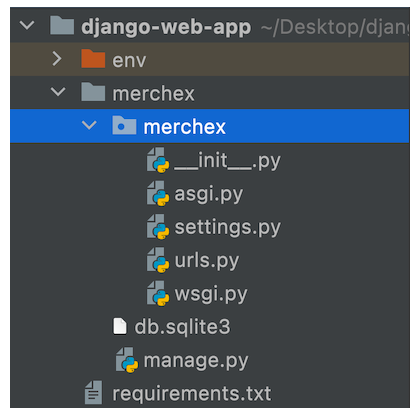

Nous appelerons la CLI Django via ce script ``manage.py``.

#### Exécuter le serveur de développement

Dès cet étape, on peut exécuter le serveur de développement avec la commande en ce plaçant dans le premier dossier ``merchex`` :
``` sh
(env) ~/projects/django-web-app/merchex
python manage.py runserver
```
Et ce rendre sur l'adresse http://127.0.0.1:8000/


#### Créer la base de données du projet

Django est configuré de base pour fonctionner avec SQLite. Les migrations permettent de créer la base de données du projet. Dès la création du projet, il y a des migrations à jouer pour configurer la base de données :

``` sh
(env) ~/projects/django-web-app/merchex
python manage.py migrate
```

Un nouveau fichier a été créé : ``db.sqlite3``. Il s'agit de la base de données qui contiendra toutes les données de l'application. Il peut judicieux de l'ajouter au ``.gitignore``.

#### Générer le code de page pour une application Django.

Dans Django, une application est une sous-section d'un projet entier. Django encourage à compartimenter un projet entier en application pour :
- garder le projet organisé au fur et à mesure qu'il se développe
- une application peut éventuellement être réutilisé dans plusieurs projets

Dans le cas d'un petit projet Django, il pourra sans peine s'intégrer dans une seule application.

Pour créer une application on lance la commande suivante :
``` sh
(env) ~/projects/django-web-app/merchex
→ python manage.py startapp listings
```

Cela va créer un nouveau répertoire ``listings`` contenant plusieurs fichiers de code de base. Ce répertoire ``listings`` se trouve à côté de ``merchex``, le répertoire du projet. Ce répetoire du projet a le même nom que le répertoire au-dessus de lui par défaut. C'est la **convention** dans la structure d'un projet Django.


Comme ``listings``, chaque répertoire d'application est spécifique à une application. Mais le répertoire de projet, ici ``merchex``,contient des fichiers de configuration pour l'ensemble du projet : c'est un peu *la tour de contrôle* du projet.

Il faut désormais installer l'application dans le projet, pour cela il faut se rendre dans le fichier ``merchex/settings.py`` :

``` python
# ~/projects/django-web-app/merchex/merchex/settings.py

INSTALLED_APPS = [
'django.contrib.admin',
...
'django.contrib.staticfiles',

'listings',
]
```
On voit donc que le code de base contient des applications déjà présentes par défaut dans le code Django.

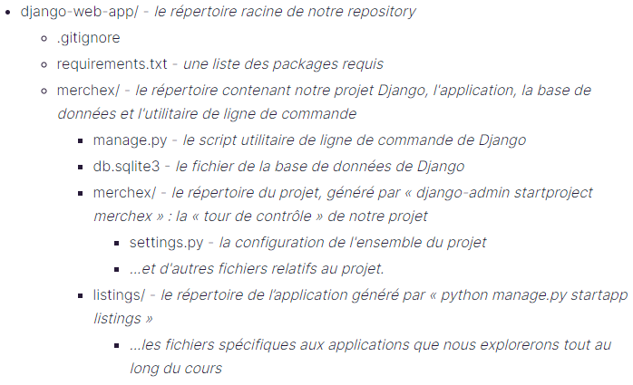

### Afficher du contenu à l'aide d'une vue

On va donc se rendre dans le fichier ``listings/views.py`` :

``` python
# ~/projects/django-web-app/merchex/listings/views.py

from django.http import HttpResponse
from django.shortcuts import render

def hello(request):
    return HttpResponse('<h1>Hello Django!</h1>')
```

Une **vue** a pour fonction de renvoyer une page que l'utilisateur peut voir. C'est une fonction qui accepte un objet ``HttpRequest`` comme paramètre et retourne un objet ``HttpResponse``.

On se rend ensuite dans le fichier ``merchex/urls.py`` que l'on modifie comme cela :

On importe le module views, puis on ajoute un nouvel élément à la liste ``urlpatterns``.

``` python
# ~/projects/django-web-app/merchex/merchex/urls.py

from django.contrib import admin
from django.urls import path
from listings import views

urlpatterns = [
path('admin/', admin.site.urls),
path('hello/', views.hello)
]
```
On peut donc désormais se rendre à la page suivante http://127.0.0.1:8000/hello/.
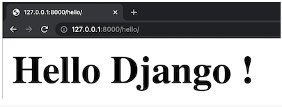

#### Exemples suplémentaires

``` python
# ~/projects/django-web-app/merchex/listings/views.py
def about(request):
    return HttpResponse('<h1>A propos</h1> <p>Site de vente de produits dérivés</p>')

def contact(request):
    return HttpResponse('<h1>Contact</h1> <p>Contactez-nous</p>')
```

``` python
# ~/projects/django-web-app/merchex/merchex/urls.py
urlpatterns = [
    path('admin/', admin.site.urls),
    path('hello/', views.hello),
    path('about-us/', views.about),
    path('contact-us/', views.contact),
]
```

### Sauvegardez les données à l'aide d'un modèle

Pour chaque **entité** pour laquelle on veut stocker des données, on va vréer un **modèle**. Le modèle définit les **caractéristiques** que l'on souhaite stocker à propos de l'entité. Ces **caractéristiques** s'appellent des **champs**.

Le **modèle** correspond presque à une **classe** en python. On va d'ailleurs créer une classe Python lorsque l'on va créer un modèle Django mais :
- contrairement à une classe où les données existent *temporairement* (par exemple seulement pendant l'exécution d'une application), le modèle sera capable de **stocker** (ou **persister**) les données dans une base de données.
- Les **caractéristiques** d'une classe sont appelées *attributs* en Python, dans un modèle il s'agira de **champs**.

Le rôle du framework Django est de dialoguer avec la base de données pour nous. Il faudra *juste* interagir avec les modèles Django.

#### Création d'un modèle

On se rend donc dans le dossier ``listings/models.py`` :

``` python
# listings/models.py

from django.db import models

class Band(models.Model):
    name = models.fields.CharField(max_length=100)
```

Ici on a donc défini la classe **Band**, qui hérite de ``models.Model`` qui est la classe de **base** du modèle de Django.
Ensuite un ajoute un **attribut** ``name`` à la classe à qui l'on affecte un **CharField** (abréviation de Character Field) de longueur maximale 100. Il s'agira d'un champ qui stocke des données de type **caractère/texte/chaîne**.

Ici il n'y a pas de **constructeur** ``__init__``, et on définit les attributs comme des attributs de **classe** et non d'**instance**. C'est Django qui va examiner les champs du modèle et va **créer** le constructeur.

**Quelles sont les différents champs existant ?**

#### Migrations

Une fois le modèle créer, c'est Django qui va se charger de mettre à jour la base de données à l'aide de migrations.

``` sh
(env) ~/projects/django-web-app/merchex
→ python manage.py makemigrations
```

Avec cette commande, Django va détecter les modifications dans les entités et va générer les migrations correspondantes.  
Cela va entraîner la création d'un fichier dans le dossier ``listings/migrations/``.  
Il faut ensuite exécuter les migrations :

``` sh
(env) ~/projects/django-web-app/merchex
→ python manage.py migrate
```

Django va chercher dans les différentes applications de notre projet s'il y a des migrations à effecter et il va les exécuter.

#### Utilisation du Shell pour enregistrer des objets en BDD

``` sh
(env) ~/projects/django-web-app/merchex
→ python manage.py shell
```
On importe le modèle :
``` python
>>> from listings.models import Band
```
On crée une nouvelle instance :
``` python
>>> band = Band()
>>> band.name = 'De La Soul'
```
On contrôle 
``` python
>>> band
<Band: Band object (None)>
```
Cela signifie que l'objet existe mais il n'a pas encore d'id. Il faut donc le sauvegarder :

``` python
>>> band.save()
>>> band
<Band: Band object (1)>
```
Il a maintenant l'id 1

``` python
>>> band = Band()
>>> band.name = 'Cut Copy'
>>> band.save()
>>> band
<Band: Band object (2)>
```
Et en une seule ligne :
``` python
>>> band = Band.objects.create(name='Foo Fighters')
```
Voici désormais nos objets :
``` python
>>> Band.objects.count()
3
>>> Band.objects.all()
<QuerySet [<Band: Band object (1)>, <Band: Band object (2)>, <Band: Band object (3)>]>
```

#### Afficher les données dans la vue

On retourne dans ``listings/views.py`` que l'on modifie pour obtenir :
``` python
# ~/projects/django-web-app/merchex/listings/views.py

...
from bands.models import Band
...

def hello(request):
    bands = Band.objects.all()
    return HttpResponse(f"""
        <h1>Hello Django !</h1>
        <p>Mes groupes préférés sont :<p>
        <ul>
            <li>{bands[0].name}</li>
            <li>{bands[1].name}</li>
            <li>{bands[2].name}</li>
        </ul>
""")
```

Explications :
- Utilisation des guillemets triples (""") pour répartir la chaîne HTML sur plusieurs lignes
- Cette chaîne est une « f-string » (f""") afin de pouvoir injecter nos noms de groupes dans la chaîne en utilisant { ... } comme placeholders.

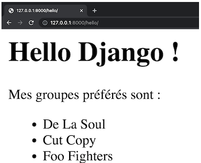

#### Exemple supplémentaire :

On crée un nouveau modèle :
``` python
# listings/models.py

from django.db import models

class Listing(models.Model):
    title = models.fields.CharField(max_length=100)
```

On n'oublie pas les **migrations** :
``` sh
(env) ~/projects/django-web-app/merchex
→ python manage.py makemigrations
→ python manage.py migrate
```

On utilise shell pour ajouter les données :

``` python
>>> from listings.models import Listing
>>> listing = Listing.objects.create(title='Affiche ORIGINALE de la tournée de De La Soul - Fillmore Auditorium San Francisco novembre 2001')
```

On retourne dans ``listings/views.py`` que l'on modifie pour obtenir :
``` python
# ~/projects/django-web-app/merchex/listings/views.py

...
from listings.models import Listing
...

def listing(request):
    listings = Listing.objects.all()
    # return render(request, 'listing.html', {'name': 'Listing'})
    return HttpResponse(f"""
        <h1>Hello Django !</h1>
        <p>Les éléments de ma liste sont :</p>
        <ul>
            {"".join([f"<li>{listing.title}</li>" for listing in listings])}
        </ul>
    """)
```

On se rend ensuite dans le fichier ``merchex/urls.py`` que l'on modifie comme cela :
``` python
# ~/projects/django-web-app/merchex/merchex/urls.py
urlpatterns = [
    path('admin/', admin.site.urls),
    path('hello/', views.hello),
    path('about-us/', views.about),
    path('contact-us/', views.contact),
    path('listing/', views.listing),
]
```

### Séparer la logique de l'application de la présentation avec un gabarit Django

Actuellement, bien que les vues soient courtes, elles sont deux responsabilités :
- sélectionner les différents objets : la **logique**
- afficher les noms/titres de chaque objet dans la page HTML : la **présentation**

Et le contenu de ces vues est amené s'agrandir avec le temps.  

On va donc adhérer au principe de responsabilité unique, qui rend le code plus maintenable, en déplaçant la responsabilité de la présentation hors de la vue et en la plaçant dans une place plus légitime : un gabarit.

#### Utilisation d'un gabarit

On crée un nouveau fichier ici : ``listings/templates/listings/hello.html``. On met toujours un sous répertoire dans le répertoire templates qui porte le même nom que l'application : ici listings.

``` html
# listings/templates/listings/hello.html

<html>
    <head><title>Merchex</title></head>
    <body>
        <h1>Hello Django !</h1>
        <p>Mes groupes préférés sont :</p>
        <!-- TODO : liste des groupes -->
    </body>
</html>
```

Grâce au fichier HTML, on a donc une coloration syntaxique et une identation automatique.

Pour générer ce gabarit, il faut mettre à jour la vue :

``` python
# listings/views.py

...
from django.shortcuts import render
...

def hello(request):
    bands = Band.objects.all()
    return render(request, 'listings/hello.html')
```

Il faut vérifier que la fonction ``render`` soit bien importée. On n'appelle donc plus le constructeur ``HttpResponse``, mais la fonction render avec 2 arguments :
- un **objet** ``request`` qui est passé dans la fonction ``hello``
- une **chaîne de caractères** contenant le chemin d'accès au fichier **gabarit** que nous avons créé.

La fonction render crée un objet ``HttpResponse`` avec le HTML de notre **modèle** et le **renvoie**. La vue renvoie donc toujours une ``HttpResponse``.


[Astuce sur l'utilisation des gabarits](https://www.formation-django.fr/framework-django/vues-templates/)


#### Passer un objet au gabarit

Il faut maintenant envoyer au gabarit la liste des groupes. Pour cela ``render`` accepte donc un 3e argument qui doit être un ``dict`` en Python.


``` python
# listings/views.py

return render(request,
        'bands/hello.html',
        {'first_band': bands[0]})
```

Ce dictionnaire est appelé dictionnaire contextuel. Chaque clé du dictionnaire devient une variable que nous pouvons utiliser dans notre modèle :

``` django
# listings/templates/listings/hello.html

<p>Mes groupes préférés sont :</p>
    <ul>
        <li>{{ first_band.name }}</li>
    </ul>
```
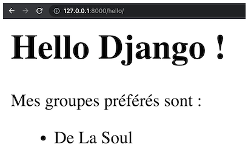

Cette syntaxe avec les accolades s'appelle le **language de gabarits Django**. Lorsque ces accolades contiennent le nom d'une variable, celle-ci sera insérée. Ce sont des **varibales de gabarits**.

On peut gagner du temps en passant tous les objets en une seule fois :

``` python
# merchex/listings/views.py
  
return render(request,
'bands/hello.html',
{'bands': bands})
```

Et le gabarit devient :
``` django
# listings/templates/listings/hello.html
<p>Mes groupes préférés sont :</p>
    <ul>
        <li>{{ bands.0.name }}</li>
        <li>{{ bands.1.name }}</li>
        <li>{{ bands.2.name }}</li>
    </ul>
```

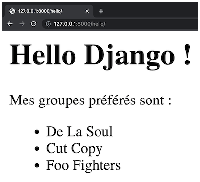

Les **gabarits** sont donc un moyen pour définir le contenu d'une page **qui ne change pas**. A l'intérieur de ces gabarits, on insère des **variables de gabarits** qui servent d'espaces réservés pour le contenu **qui change**. Grâce aux **gabarits**, on garde la vue libre de toute code de présentation et on **limite** la responsabilité de la vue à une seule chose : la **logique** pour récupérer les données correctes de la base de données et les **injecter** dans la page.

#### Fonctionnalités des gabarits

Django autorise donc certaines éléments de logique dans les gabarits.

On peut également **construire une boucle** pour traiter une liste dont la longueur serait variable :
``` django
  <p>Mes groupes préférés sont :</p>
  <ul>
    
    <li>{{ band.name }}</li>
    
  </ul>
```
Explications :
- Les boucles et autres instructions logiques sont entourées de crochets et de signes de pourcentage ````. Il s'agit de **balises de gabarits**.
- Une instruction ``for`` est construite en utilisant une syntaxe similaire à celle de Python
- En général on utilise le format conventionnel ``for singulier in pluriel``
- Une balise de gabarit ``for`` doit posséder une balise de fermeture ``endfor``.
- L'espace entre les balises ``for`` et ``endfor`` peut contenir du texte, du HTML et même des variables de gabarits Django.

On peut également **utiliser des filtres** dans les gabarits comme ``lower``, ``upper``, ``length``

``` django
  <p>Mes groupes préférés sont :</p>
  <ul>
    
    <li>{{ band.name|upper }}</li>
    
  </ul>
```
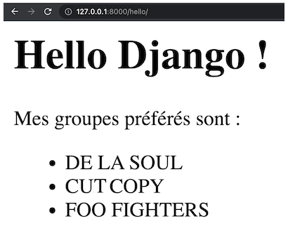

On peut également **utiliser des instructions if** dans les gabarits

``` django
<p>
    J'ai..
    
        peu de
    
        quelques
    
        beaucoup de
    
        groupes préférés.
</p>
```

#### Bilan

- On crée un gabarait dans listings/templates/listings/ et on lui donne l'extension html
- on déplace le code HTML dans le gabarit, hors de la vue
- dans la vue, c'est render qui se charger de renvoyer la page HTML, on lui passe donc le chemin
- on lui passe également un dictionnaire avec les variables de gabarit
- on utilise les balises de gabarit pour afficher le contenu des variables

### Ajoutez structure et style au site internet

#### Templating

Pour réutiliser le code HTML qui ne change pas et respecter le DRY (Don't Repeat Yourself), on peut utiliser un système de templating.

On peut créer un nouveau fichier gabarit à l'adresse ``listings/templates/listings/base.html``:
``` html
# listings/templates/listings/base.html
<!DOCTYPE html>
<html lang="en">
<head>
  <meta charset="UTF-8">
  <meta http-equiv="X-UA-Compatible" content="IE=edge">
  <meta name="viewport" content="width=device-width, initial-scale=1.0">
  <title>Merchex</title>
</head>
<body>

  
  
</body>
</html>
```

On a crée un block à l'aide des balises ``block`` et ``endblock``, et on lui a donné un nom : ``content``. On pourra y ajouter du contenu plus tard.

On va maintenant modifier le code du fichier ``hello.html`` et le modifier pour le faire hériter du fichier ``base.html`` à l'aide de la balide ``extends`` :

``` html




  <h1>Hello Django !</h1>
  <!-- TODO : liste des groupes -->
  <p>J'ai {{ bands|length }} groupes préférés.</p>
  <p>Mes groupes préférés sont :</p>
  <ul>
    
    <li>{{ band.name|upper }}</li>
    
  </ul>


```

[Balises et filtres de gabarit](https://docs.djangoproject.com/fr/4.2/ref/templates/builtins/)

On peut donc utiliser ce gabarit de base pour toutes les pages de notre choix. Ce gabarit peut donc comporter le header, le footer par exemple pour n'avoir à le modifier qu'une seule fois et non sur toutes les pages où ils se trouvent.

#### Ajouter du CSS

On crée le fichier suivant : ``listings/static/listings/styles.css`` dans lequel on écrit du style :

``` css
* { background: red }
```
Puis il faut modifier le fichier `listings/templates/listings/base.html` pour y rajouter la feuille de style dans la balise suivante : `` et ``
``` html
<!DOCTYPE html>

<html lang="en">
<head>
  <meta charset="UTF-8">
  <meta http-equiv="X-UA-Compatible" content="IE=edge">
  <meta name="viewport" content="width=device-width, initial-scale=1.0">
  <link rel="stylesheet" href="">
  <title>Merchex</title>
</head>
<body>

  
  
</body>
</html>
```

## Gérer les données à l'aide du site de l'adminsitration de Django

### Capturer les données avec des modèles et des champs

Le modèle ressemble à cela jusque maintenant :
``` python
# listings/models.py

class Band(models.Model):
    name = models.fields.CharField(max_length=100)
```

Il est possible d'ajouter d'autres champs, d'autres types différents :
``` python
# listings/models.py

class Band(models.Model):
    name = models.fields.CharField(max_length=100)
    genre = models.fields.CharField()
    biography = models.fields.CharField()
    year_formed = models.fields.IntegerField()
    active = models.fields.BooleanField()
    official_homepage = models.fields.URLField()
```

[Documentations Fields](https://docs.djangoproject.com/en/4.2/ref/models/fields/)

- ``name``, ``genre`` qui contiennent des données de type **chaîne de caractère** : ``CharField``
- ``year`` est un nombre **entier** : ``IntegerField``. Il existe également ``DateField`` mais ici le mois et le jour ne sont pas utile.
- ``active`` est un **booléan** : ``BooleanField`` qui contiendra les valeurs True ou False
- ``official_homepage`` qui contient une adresse web ; ``URLField``. ``CharField`` aurait pu fonctionner mais ``URLField`` n'autorisera que les **URL valides**.

Attention il est parfois nécessaire de passer des arguments aux champs :
- ``CharField`` : l'option ``max_length`` est obligatoire
- ``year_formed`` : doit avoir des valeurs **minimales** et **maximales**. Pour appliquer ces contraintes, on utilise l'option ``validators`` avec les classes ``MinValueValidator`` et ``MaxValueValidator`` intégrées à Django et qu'il ne faudra pas oublier d'importer.
- ``active`` : valeur par défaut : ``default=True``.
- ``official_homepage`` : on utilise l'option ``null=True`` pour autoriser les valeurs **NULL** en BDD. ``blank=True`` permettra de soumettre le formulaire avec une zone de texte **vide** pour ce champ.

``` python
# listings/models.py

from django.core.validators import MaxValueValidator, MinValueValidator
...

    class Band(models.Model):
      name = models.fields.CharField(max_length=100)
      genre = models.fields.CharField(max_length=50)
      biography = models.fields.CharField(max_length=1000)
      year_formed = models.fields.IntegerField(
      validators=[MinValueValidator(1900), MaxValueValidator(2021)]
      )
      active = models.fields.BooleanField(default=True)
      official_homepage = models.fields.URLField(null=True, blank=True)
```

[Documentation validateurs](https://docs.djangoproject.com/fr/3.2/ref/validators/)

### CRUD dans l'administration Django

On commence d'abord par créer un super user :
``` python
python manage.py createsuperuser
```
Et on suit les indications de la CLI.

On va ensuite dans le fichier admin.py pour le modifier comme cela :
``` python
# listings/admin.py

from django.contrib import admin

from listings.models import Band

admin.site.register(Band)
```
Ensuite, on peut se rendre à l'adresse suite et s'identifier :
http://127.0.0.1:8000/admin/ :

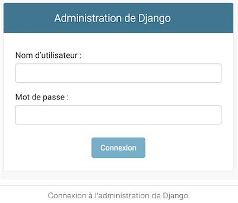
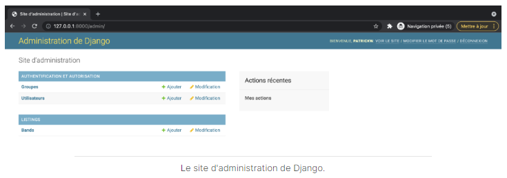

On peut, depuis cet interface, procéder aux différents étapes du CRUD sur nos entités.

Lors que l'on clique sur notre entité, on arrive sur cette page :
http://127.0.0.1:8000/admin/listings/band/

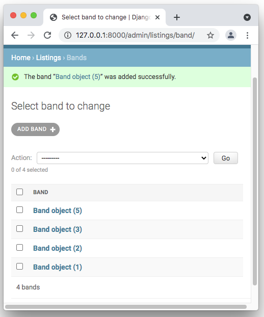

Cette interface est une interface d'administration. Elle n'est pas destinée aux utilisateurs du site même si toutes les opérations du CRUD sont possibles. Elles permettent juste aux développeurs d'avoir une interface d'adminsitration pour le client du site.

On peut également améliorer l'affichage de la vue d'une entité. Le 'R' du CRUD.

Pour cela, on peut commencer par modifier notre fichier model.py 
``` python
class Band(models.Model):
   …
   def __str__(self):
    return f'{self.name}'
```

On observe ainsi :
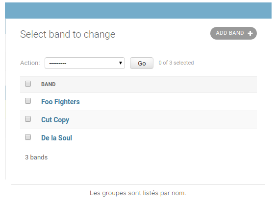

En modifiant le fichier admin.py on peut encore afficher plus d'informations :

``` python
# listings/admin.py

from django.contrib import admin

from bands.models import Band

class BandAdmin(admin.ModelAdmin):  # nous insérons ces deux lignes..
list_display = ('name', 'year_formed', 'genre') # liste les champs que nous voulons sur l'affichage de la liste

admin.site.register(Band, BandAdmin) # nous modifions cette ligne, en ajoutant un deuxième argument
```
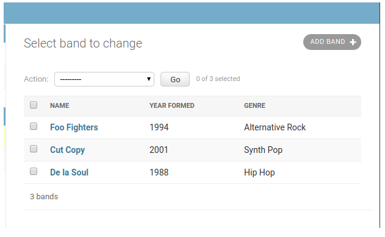

### Relation Many To One avec une clé étrangère

Pour créer une clé étrangère ``band_id`` dans l'entité Listing avec l'id d'un band correspondant :

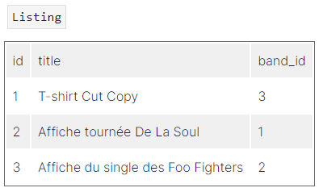


``` python
class Listing(models.Model):

   ...
   band = models.ForeignKey(Band, null=True, on_delete=models.SET_NULL)
```

On nomme ce champ ``band``. Cela permettra d'obtenir le groupe de n'importe quel annonce en appelant ``listing.band``. On passe également trois argument à ``ForeignKey`` :
- le modèle auquel on veut se rattacher : **Band**,
- **null=True** parce que l'on veut permettra la création d'annonce même si elles ne sont pas directement liées à un groupe,
- **on_delete=models.SET_NULL** : c'est ici que l'on décide de la stratégie à suivre lorsque les objets Band sont supprimés :
  - définir band comme null en utilisant models.SET_NULL
  - définir band à sa valeur par défaut en utilisant models.SET_DEFAULT,
  - supprimer l'objet Listing en utilisant models.CASCADE
  - autres https://docs.djangoproject.com/fr/3.2/ref/models/fields/#foreignkey


Ici on utilise **SET_NULL** pour ne pas supprimer l'annonce si un Band est supprimé.

Pour enregistrer les modifications en base de données on n'oublie pas les commandes suivantes :

``` sh
python manage.py makemigrations
python manage.py migrate
```

Dans l'administration de Django, pour ajouter une annonce (entité Listing), on se rend à l'adresse suivante :  
http://127.0.0.1:8000/admin/listings/listing/add/

Et on observe :
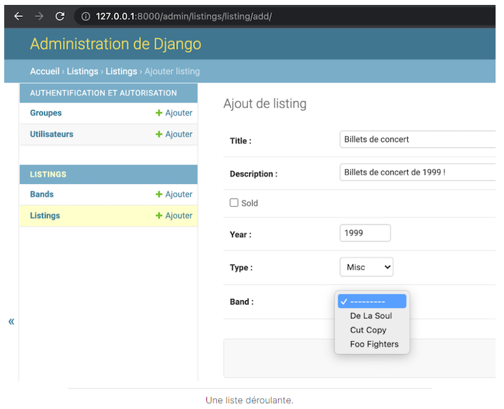

On modifie ensuite l'affichage du panneau admin pour faire apparaître le groupe dans chaque annonce :

``` python
class ListingAdmin(admin.ModelAdmin):
list_display = ('title', 'band')  # ajouter ‘band' ici
```
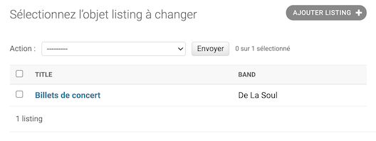

### Annuler une migration

#### La migration n'a pas été partagée avec d'autres développeurs

Exemple :
``` python
class Band(models.Model):

   …
   like_new = models.fields.BooleanField(default=False)
```
Puis on exécute les migrations :
``` sh
python manage.py makemigrations
python manage.py migrate
```

Ensuite on lance la commande suivante pour lister les migrations :

``` sh
python manage.py showmigrations
```

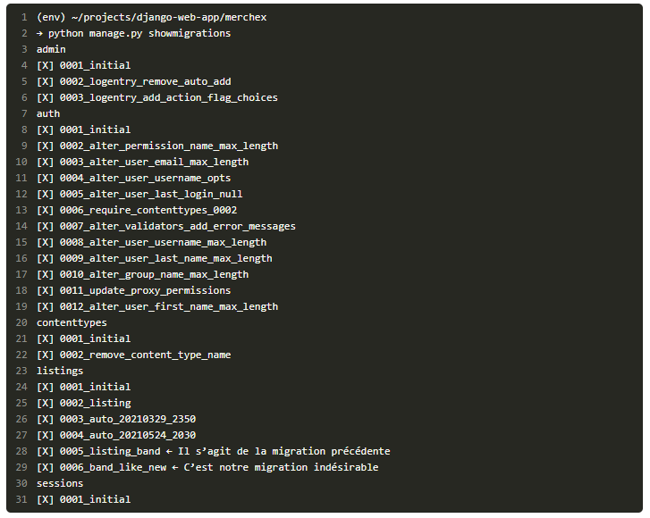

On trouve le nom de la migration qui doit être annulée ici ``0006_band_like_new``, et on récupère le nom de la migration précédente ``0005_listing_band`` et le nom de l'application correspondante listings.

Pour annuler la migration on lance alors la commande suivante :

``` sh
python manage.py migrate listings 0005_listing_band
```
On peut alors constater :
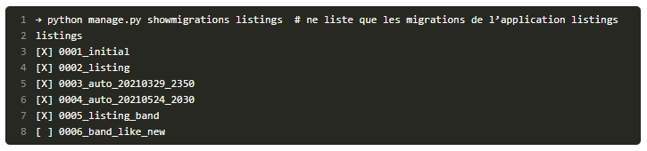

La migration a donc été annulée mais pas supprimer. Si on veut le faire il faut lancer la commande suivante :
``` sh
 rm listings/migrations/0006_band_like_new.py 
```

#### La migration n'a pas été partagée avec d'autres développeurs

Si les migrations ont déjà été partagées et jouées sur un autre ordinateur, la méthode précédente ne fonctionne pas. Il faut recréer une nouvelle migration pour annuler les modifications.

Pour ce cas de figure, il suffit de supprimer la ligne rajoutée précédemment pour ensuite créer et exécuter les migrations.


#### Les conflits de migration

Lorsque plusieurs développeurs travaillent sur un même projet, ils peuvent créer des migrations sur leur branche de travail. Cependant, lors de la fusion des branches, il y aura donc plusieurs migrations avec le même numéro. Exemple :
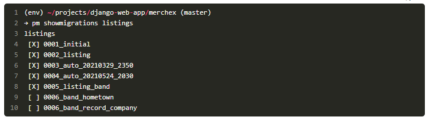

Mais si on essait de jouer les migrations, il se produira une erreur :
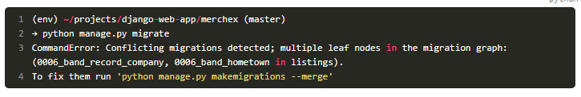

Comme les deux migrations ont le même numéro, python ne sait pas quelle migration exécuter en premier. Pour cela, comme indiquer dans le message d'erreur, on va utiliser le flag --merge

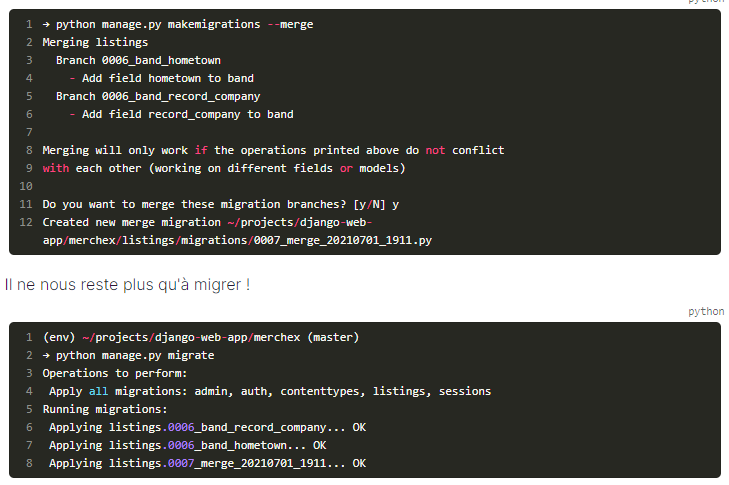

Attention : cette technique ne fonctionne que si les migrations n'affectent pas le même champ sur le même modèle. Si tel est le cas, le meilleure chose est de supprimer les migrations en conflit et d'en créer de nouvelles à la place.

## Construire une interface CRUD avec Django


``` python
```

``` python
```


``` python
```

``` python
```

``` python
```

``` python
```

``` python
```

``` python
```

``` python
```

``` python
```


``` python
```

``` python
```

``` python
```
``` python
```

``` python
```

``` python
```

``` python
```

``` python
```

``` python
```

``` python
```

``` python
```
``` python
```

``` python
```

``` python
```

``` python
```

``` python
```

``` python
```

``` python
```

``` python
```
``` python
```

``` python
```

``` python
```

``` python
```

``` python
```

``` python
```

``` python
```

``` python
```
``` python
```

``` python
```

``` python
```

``` python
```

``` python
```

``` python
```

``` python
```

``` python
```


``` python
```

``` python
```

``` python
```

``` python
```

``` python
```

``` python
```

``` python
```

``` python
```